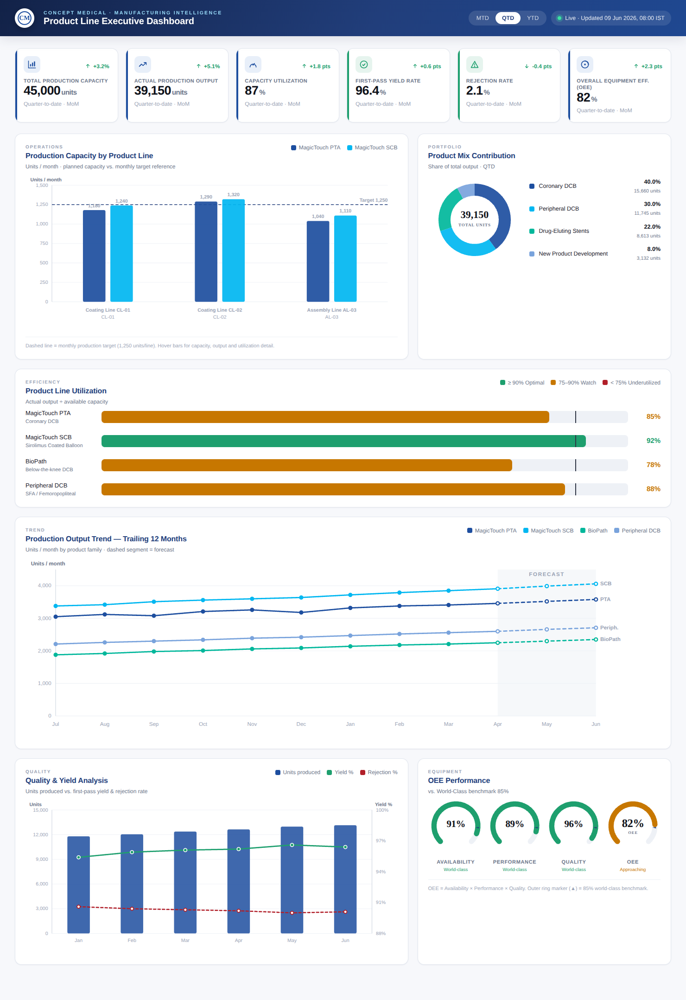

# Product Line Executive Dashboard — Concept Medical

A redesign of the basic *"Production Line Capacity by Product"* chart into a
comprehensive, executive-level **Product Line Performance Dashboard** for a
medical-device manufacturing company, built in the Concept Medical brand
language (DCB / DES portfolio).

> **Open it:** double-click `dashboard/index.html` — it is fully self-contained
> (no build step, no server, one network call for the Poppins web font). It
> deploys exactly like the rest of this repo (GitHub Pages / Netlify / e-mail).



---

## 1. What changed vs. the original

| Original | Redesign |
|---|---|
| Single grouped bar chart (P1/P2 × Line A/B/C) | 6 KPI cards + 6 coordinated charts |
| Generic product / line names | Real portfolio: **MagicTouch PTA / SCB, BioPath, Peripheral DCB**; real lines **CL-01, CL-02, AL-03** |
| Default Chart.js palette | Concept Medical brand tokens (CM blue scale + teal/cyan/azure accents) |
| No targets, no interactivity | Target reference line, hover tooltips, data labels, interactive legends, animated gauges, MTD/QTD/YTD toggle |
| Capacity only | Capacity **+ utilization + product mix + 12-month trend + quality/yield + OEE** |

---

## 2. Layout (delivered wireframe)

```
┌──────────────────────────────────────────────────────────────────────┐
│ APP BAR — CM mark · "Product Line Executive Dashboard" · MTD/QTD/YTD · Live │
├──────────────────────────────────────────────────────────────────────┤
│ KPI CARDS ×6:  Capacity · Output · Utilization% · Yield% · Rejection% · OEE │
├───────────────────────────────────────────┬──────────────────────────┤
│ Production Capacity by Product Line        │ Product Mix Contribution  │
│ (grouped column + target line)             │ (donut + legend)          │
├───────────────────────────────────────────┴──────────────────────────┤
│ Product Line Utilization  (color-coded horizontal bars, 90% target)    │
├────────────────────────────────────────────────────────────────────── ┤
│ Production Output Trend — 12 months (multi-line + forecast band)       │
├───────────────────────────────────────────┬──────────────────────────┤
│ Quality & Yield Analysis (combo)           │ OEE Performance (gauges)  │
└───────────────────────────────────────────┴──────────────────────────┘
```

The grid collapses to a single column on tablet/mobile; KPI cards reflow
6 → 3 → 2 across breakpoints.

---

## 3. Chart specifications

| # | Visual | Type | Encoding / metrics | Interactions |
|---|---|---|---|---|
| KPI | 6 cards | Card + spardelta | value, MoM delta, trend arrow, period label | hover lift; tone (good/warn) drives accent |
| 1 | Production Capacity by Product Line | **Grouped column** | units/month per product per line; **dashed target = 1,250** | hover → capacity / output / utilization; animated grow; data labels |
| 2 | Product Mix Contribution | **Donut** | share of total output; center = total units | hover segment → units + share; legend % + units |
| 3 | Product Line Utilization | **Horizontal bar** | output ÷ capacity; **green ≥90 / amber 75–90 / red <75**; 90% target tick | hover → cap/output/util; animated fill |
| 4 | Production Output Trend | **Multi-line** | 12 months × 4 families; **dashed = forecast** (shaded band) | clickable legend toggles series; per-point tooltips; end labels |
| 5 | Quality & Yield Analysis | **Combo** (bars + 2 lines) | bars = units; lines = yield% (right axis) & rejection% | toggle each series; shared tooltip |
| 6 | OEE Performance | **Radial gauge ×4** | Availability / Performance / Quality / OEE; **▲ = 85% world-class** | animated sweep; color vs. benchmark |

Color thresholds (utilization & OEE) use the brand semantic tokens
`--success #1E9F6E`, `--warning #C77700`, `--danger #B11F29`.

---

## 4. Recommended Power BI visual types

The HTML is the design reference; in Power BI build it with:

| Dashboard element | Power BI visual | Notes |
|---|---|---|
| KPI cards | **Card** (or *KPI* visual) + small multiples | Use a measure for MoM %; conditional formatting for tone |
| Capacity by line | **Clustered column chart** | Legend = Product; Axis = Production Line; add **constant line** (Analytics pane) at 1,250 |
| Product mix | **Donut chart** | Detail labels = Percent of total; center total via *card* overlay |
| Utilization | **Bar chart** with **field-based conditional formatting** | Or *Tornado / Bullet* (marketplace) for target marker; rule: ≥90 green, 75–90 amber, <75 red |
| Trend (12 mo) | **Line chart** with **Forecast** (Analytics pane) | Or split actual/forecast measures; legend = Product family |
| Quality & Yield | **Line and clustered column chart** | Column = Units (primary axis); Lines = Yield%, Rejection% (secondary axis) |
| OEE | **Gauge** ×4 (or *Radial Gauge* from marketplace) | Target = 85; max = 100; color by value vs. target |
| Period toggle | **Field/Slicer** (Tile) MTD/QTD/YTD | Drive with a date-intelligence measure set |

Brand: import the CM palette as a Power BI **theme JSON** (see §6) and set
Poppins as the report font.

---

## 5. UX improvements

- **Executive hierarchy** — KPI band answers "are we healthy?" in one glance;
  charts below answer "why / where?".
- **Status semantics over decoration** — color encodes performance
  (green/amber/red), not just series identity.
- **Targets everywhere** — capacity target line, 90% utilization tick, 85% OEE
  benchmark, MoM deltas — every number has a reference point.
- **Progressive disclosure** — headline value on the surface, detail
  (capacity/output/util) on hover; legends toggle to declutter.
- **Forecasting made obvious** — solid = actuals, dashed + shaded band =
  forecast, consistently across the trend chart.
- **Accessibility** — semantic landmarks (`header`/`main`/`section`),
  `aria-label`/`role="img"` on charts, AA-contrast text, `prefers-reduced-motion`
  honoured by the brand CSS, tabular-numeric figures, color paired with
  text labels (not color-only).
- **Responsive** — fluid SVG `viewBox` charts; grid reflows to one column;
  KPI cards 6→3→2.

---

## 6. Data model recommendations

A compact star schema feeds every visual:

```
Fact_Production            Dim_Product               Dim_Line
-----------------          -----------------         -----------------
DateKey        (FK)        ProductKey (PK)           LineKey (PK)
ProductKey     (FK)        ProductName               LineName  (CL-01…)
LineKey        (FK)        Family (PTA/SCB/BioPath/   LineType  (Coating/
ShiftKey       (FK)          Peripheral/DES/NPD)        Assembly)
UnitsPlanned   (capacity)  Segment (Coronary/        Plant / Site
UnitsProduced  (output)      Peripheral/DES/NPD)
UnitsRejected
RunTimeMins / PlannedMins  Dim_Date (date intelligence: MTD/QTD/YTD)
IdealCycleSec              Dim_Shift
```

Core DAX measures:

- `Utilization % = DIVIDE(SUM(UnitsProduced), SUM(UnitsPlanned))`
- `Yield % = 1 - DIVIDE(SUM(UnitsRejected), SUM(UnitsProduced))`
- `Rejection % = DIVIDE(SUM(UnitsRejected), SUM(UnitsProduced))`
- `Availability = DIVIDE(SUM(RunTimeMins), SUM(PlannedMins))`
- `Performance = DIVIDE(SUM(IdealCycleSec)*SUM(UnitsProduced)/60, SUM(RunTimeMins))`
- `Quality = Yield %`
- `OEE = [Availability] * [Performance] * [Quality]`
- MoM deltas via `CALCULATE(..., DATEADD(Dim_Date[Date], -1, MONTH))`

CM theme JSON (drop into Power BI → View → Themes):

```json
{
  "name": "Concept Medical",
  "dataColors": ["#1D4E9F","#00B7F1","#00B79B","#79A3DC","#3260AD","#8871B3"],
  "good": "#1E9F6E", "neutral": "#C77700", "bad": "#B11F29",
  "background": "#FFFFFF", "foreground": "#1B202B", "tableAccent": "#1D4E9F"
}
```

---

## 7. Notes

- All figures are **illustrative sample data** for design/demo purposes
  (see the `DATA` object near the top of the `<script>` in `index.html`).
  Swap in live values or wire to your warehouse / Power BI model.
- The MTD/QTD/YTD toggle scales volume metrics by an illustrative factor so the
  interaction is demonstrable without a backend.
- Brand tokens mirror `colors_and_type.css` from the homepage project so the
  dashboard sits consistently inside the Concept Medical system.
